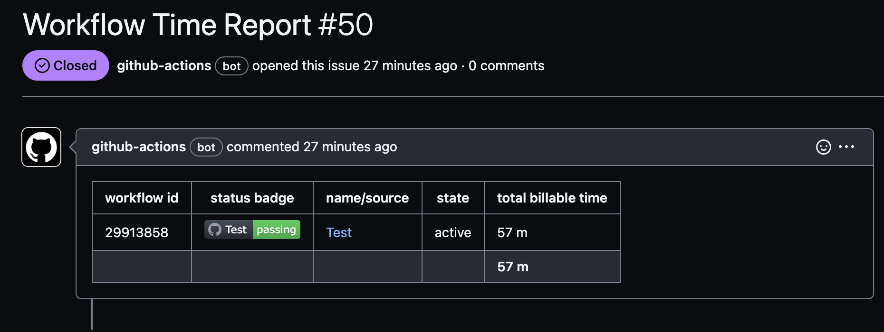

# Workflow Time Report

[](https://github.com/MichinaoShimizu/workflow-time-report/actions/workflows/test.yml)

Create a ISSUE and reporting `Billable Time` of workflows.



## Usage

```yaml
- uses: MichinaoShimizu/workflow-time-report@v4
```

## Example

```yaml
name: Weekly Report Tasks

on:
  schedule:
    - cron: '0 1 * * 1'

  workflow_dispatch: ~

jobs:
  reporting:
    runs-on: ubuntu-latest
    timeout-minutes: 5
    steps:
      - uses: actions/checkout@v3
      - uses: MichinaoShimizu/workflow-time-report@v4
```
